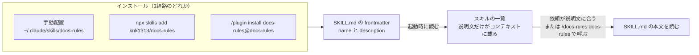
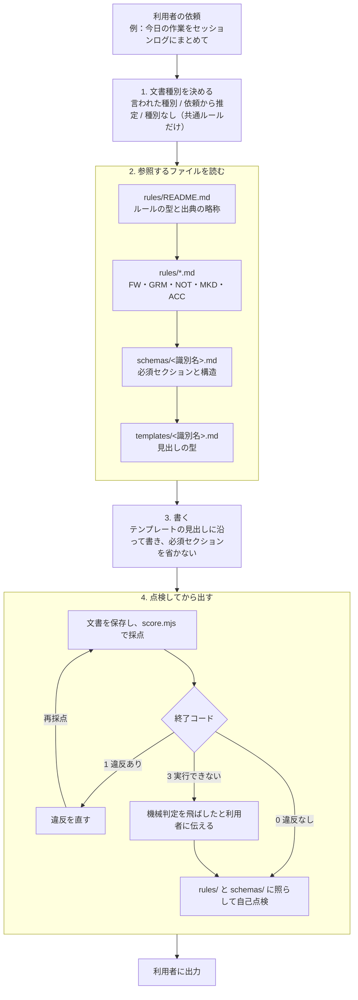
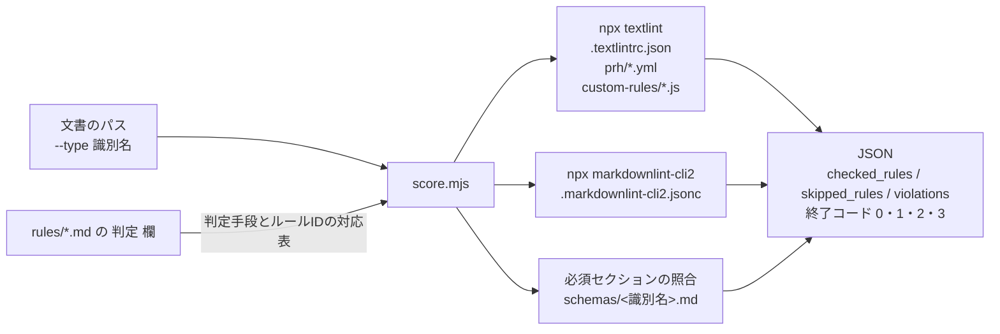
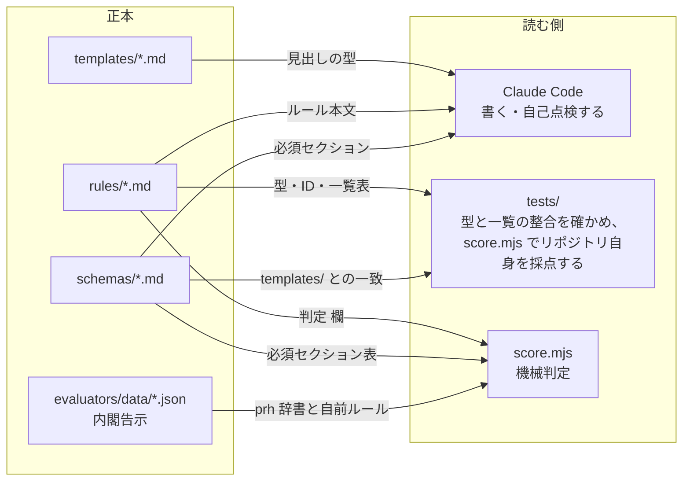
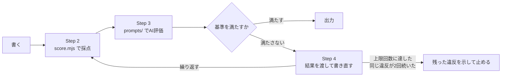

# アーキテクチャ

Claude Codeがdocs-rulesのスキルをどう読み込み、1つの文書を書くときに何をどの順で使うかを図で示す。

## 1. 配布からスキルの起動まで

```mermaid
flowchart LR
    subgraph install["インストール（3経路のどれか）"]
        direction TB
        A1["手動配置<br>~/.claude/skills/docs-rules"]
        A2["npx skills add knk1313/docs-rules"]
        A3["/plugin install docs-rules@docs-rules"]
    end
    install --> B["SKILL.md の frontmatter<br>name と description"]
    B -->|起動時に読む| C["スキルの一覧<br>説明文だけがコンテキストに載る"]
    C -->|依頼が説明文に合う<br>または /docs-rules:docs-rules で呼ぶ| D["SKILL.md の本文を読む"]
```

## 2. 文書を書く流れ

```mermaid
flowchart TD
    S["利用者の依頼<br>例：今日の作業をセッションログにまとめて"]
    S --> T1["1. 文書種別を決める<br>言われた種別 / 依頼から推定 / 種別なし（共通ルールだけ）"]
    T1 --> T2
    subgraph T2["2. 参照するファイルを読む"]
        direction TB
        R0["rules/README.md<br>ルールの型と出典の略称"]
        R1["rules/*.md<br>FW・GRM・NOT・MKD・ACC"]
        R2["schemas/&lt;識別名&gt;.md<br>必須セクションと構造"]
        R3["templates/&lt;識別名&gt;.md<br>見出しの型"]
        R0 --> R1 --> R2 --> R3
    end
    T2 --> T3["3. 書く<br>テンプレートの見出しに沿って書き、必須セクションを省かない"]
    T3 --> T4
    subgraph T4["4. 点検してから出す"]
        direction TB
        P1["文書を保存し、score.mjs で採点"]
        P2{"終了コード"}
        P3["違反を直す"]
        P4["機械判定を飛ばしたと利用者に伝える"]
        P5["rules/ と schemas/ に照らして自己点検"]
        P1 --> P2
        P2 -->|1 違反あり| P3
        P3 -->|再採点| P1
        P2 -->|0 違反なし| P5
        P2 -->|3 実行できない| P4
        P4 --> P5
    end
    T4 --> OUT["利用者に出力"]
```

## 3. 採点の入口の内部

```mermaid
flowchart LR
    IN["文書のパス<br>--type 識別名"] --> S
    RULES["rules/*.md の 判定 欄"] -->|判定手段とルールIDの対応表| S
    S["score.mjs"]
    S --> T["npx textlint<br>.textlintrc.json<br>prh/*.yml<br>custom-rules/*.js"]
    S --> M["npx markdownlint-cli2<br>.markdownlint-cli2.jsonc"]
    S --> SC["必須セクションの照合<br>schemas/&lt;識別名&gt;.md"]
    T --> J
    M --> J
    SC --> J
    J["JSON<br>checked_rules / skipped_rules / violations<br>終了コード 0・1・2・3"]
```

## 4. 誰が何を読むか

```mermaid
flowchart LR
    subgraph src["正本"]
        direction TB
        TPL["templates/*.md"]
        RU["rules/*.md"]
        SCH["schemas/*.md"]
        DATA["evaluators/data/*.json<br>内閣告示"]
    end
    subgraph readers["読む側"]
        direction TB
        AI["Claude Code<br>書く・自己点検する"]
        TEST["tests/<br>型と一覧の整合を確かめ、<br>score.mjs でリポジトリ自身を採点する"]
        SCORE["score.mjs<br>機械判定"]
    end
    TPL -->|見出しの型| AI
    RU -->|ルール本文| AI
    RU -->|型・ID・一覧表| TEST
    RU -->|判定 欄| SCORE
    SCH -->|必須セクション| AI
    SCH -->|templates/ との一致| TEST
    SCH -->|必須セクション表| SCORE
    DATA -->|prh 辞書と自前ルール| SCORE
```

## 5. ロードマップ上の位置

```mermaid
flowchart LR
    W["書く"] --> S2["Step 2<br>score.mjs で採点"]
    S2 --> S3["Step 3<br>prompts/ でAI評価"]
    S3 --> J{"基準を満たすか"}
    J -->|満たす| OUT["出力"]
    J -->|満たさない| S4["Step 4<br>結果を渡して書き直す"]
    S4 -->|繰り返す| S2
    S4 -->|上限回数に達した<br>同じ違反が2回続いた| STOP["残った違反を示して止める"]
```
