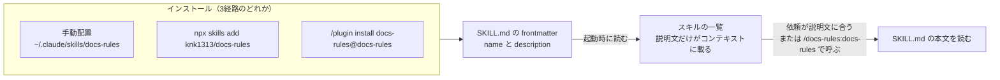
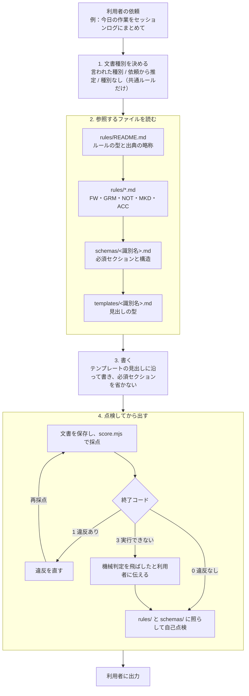

# アーキテクチャ

Claude Codeがdocs-rulesのスキルをどう読み込み、1つの文書を書くときに何をどの順で使うかを図で示す。

## 1. 配布からスキルの起動まで

```mermaid
flowchart LR
    subgraph install["インストール（3経路のどれか）"]
        direction TB
        A1["手動配置<br>~/.claude/skills/docs-rules"]
        A2["npx skills add knk1313/docs-rules"]
        A3["/plugin install docs-rules@docs-rules"]
    end
    install --> B["SKILL.md の frontmatter<br>name と description"]
    B -->|起動時に読む| C["スキルの一覧<br>説明文だけがコンテキストに載る"]
    C -->|依頼が説明文に合う<br>または /docs-rules:docs-rules で呼ぶ| D["SKILL.md の本文を読む"]
```

## 2. 文書を書く流れ

```mermaid
flowchart TD
    S["利用者の依頼<br>例：今日の作業をセッションログにまとめて"]
    S --> T1["1. 文書種別を決める<br>言われた種別 / 依頼から推定 / 種別なし（共通ルールだけ）"]
    T1 --> T2
    subgraph T2["2. 参照するファイルを読む"]
        direction TB
        R0["rules/README.md<br>ルールの型と出典の略称"]
        R1["rules/*.md<br>FW・GRM・NOT・MKD・ACC"]
        R2["schemas/&lt;識別名&gt;.md<br>必須セクションと構造"]
        R3["templates/&lt;識別名&gt;.md<br>見出しの型"]
        R0 --> R1 --> R2 --> R3
    end
    T2 --> T3["3. 書く<br>テンプレートの見出しに沿って書き、必須セクションを省かない"]
    T3 --> T4
    subgraph T4["4. 点検してから出す"]
        direction TB
        P1["文書を保存し、score.mjs で採点"]
        P2{"終了コード"}
        P3["違反を直す"]
        P4["機械判定を飛ばしたと利用者に伝える"]
        P5["rules/ と schemas/ に照らして自己点検"]
        P1 --> P2
        P2 -->|1 違反あり| P3
        P3 -->|再採点| P1
        P2 -->|0 違反なし| P5
        P2 -->|3 実行できない| P4
        P4 --> P5
    end
    T4 --> OUT["利用者に出力"]
```
