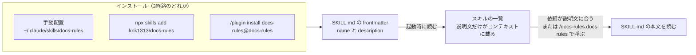
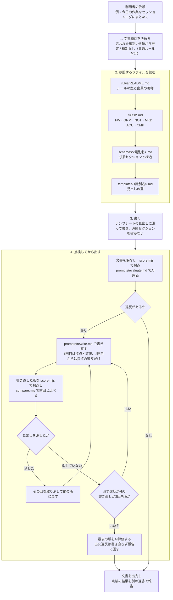

# docs-rulesのアーキテクチャ

Claude Codeがdocs-rulesのスキルをどう読み込み、一つの文書を書くときに何をどの順で使うかを図で示す。

## 1. 配布からスキルの起動まで

```mermaid
flowchart LR
    subgraph install["インストール（3経路のどれか）"]
        direction TB
        A1["手動配置<br>~/.claude/skills/docs-rules"]
        A2["npx skills add knk1313/docs-rules"]
        A3["/plugin install docs-rules@docs-rules"]
    end
    install --> B["SKILL.md の frontmatter<br>name と description"]
    B -->|起動時に読む| C["スキルの一覧<br>説明文だけがコンテキストに載る"]
    C -->|依頼が説明文に合う<br>または /docs-rules:docs-rules で呼ぶ| D["SKILL.md の本文を読む"]
```

## 2. 文書を書く流れ

```mermaid
flowchart TD
    S["利用者の依頼<br>例：今日の作業をセッションログにまとめて"]
    S --> T1["1. 文書種別を決める<br>言われた種別 / 依頼から推定 / 種別なし（共通ルールだけ）"]
    T1 --> T2
    subgraph T2["2. 参照するファイルを読む"]
        direction TB
        R0["rules/README.md<br>ルールの型と出典の略称"]
        R1["rules/*.md<br>FW・GRM・NOT・MKD・ACC・CMP"]
        R2["schemas/&lt;識別名&gt;.md<br>必須セクションと構造"]
        R3["templates/&lt;識別名&gt;.md<br>見出しの型"]
        R0 --> R1 --> R2 --> R3
    end
    T2 --> T3["3. 書く<br>テンプレートの見出しに沿って書き、必須セクションを省かない"]
    T3 --> T4
    subgraph T4["4. 点検してから出す"]
        direction TB
        P1["文書を保存し、score.mjs で採点<br>prompts/evaluate.md でAI評価"]
        P2{"違反があるか"}
        P3["prompts/rewrite.md で書き直す<br>1回目は採点と評価、2回目からは採点の違反だけ"]
        P4["書き直した版を score.mjs で採点し<br>compare.mjs で前回と比べる"]
        P5{"見出しを消したか"}
        P6["その回を取り消して前の版に戻す"]
        P7{"渡す違反が残り<br>書き直しが3回未満か"}
        P8["最後の版をAI評価する<br>出た違反は書き直さず報告に回す"]
        P1 --> P2
        P2 -->|あり| P3
        P3 --> P4 --> P5
        P5 -->|消した| P6
        P6 --> P3
        P5 -->|消していない| P7
        P7 -->|はい| P3
        P7 -->|いいえ| P8
    end
    P2 -->|なし| OUT
    P8 --> OUT["文書を出力し<br>点検の結果を別の返答で報告"]
```
